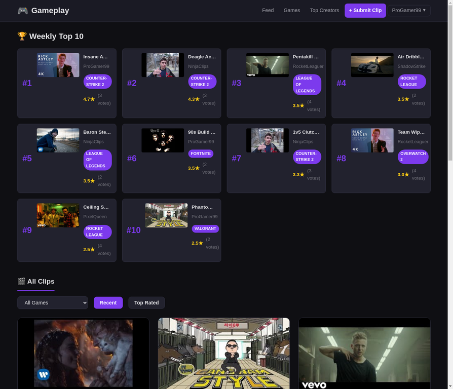
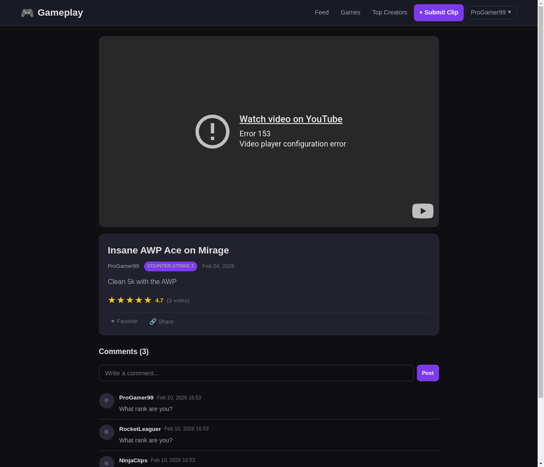

# CS50W Capstone Project: Gameplay

**Autor:** Javier Sese
**Fecha:** 10 de Febrero de 2026

## Resumen del Proyecto

Este proyecto, "Gameplay", es una plataforma de curación de contenido audiovisual impulsada por la comunidad, centrada en videoclips cortos de jugadas de videojuegos. La plataforma está organizada por videojuegos y clasifica los clips a través de valoraciones explícitas de los usuarios, en lugar de algoritmos sociales opacos. Fue desarrollada utilizando Django y JavaScript, cumpliendo con todos los requisitos del proyecto final de CS50W.

## Distintividad y Complejidad

El proyecto se diferencia fundamentalmente de los proyectos anteriores del curso, en particular del Proyecto 4 "Network", al evitar el modelo de una red social tradicional. En lugar de centrarse en las conexiones entre usuarios (seguidores/seguidos), "Gameplay" se centra en el contenido mismo: los clips. Las características sociales están subordinadas a la función principal de curación y descubrimiento de contenido.

La complejidad del proyecto se manifiesta en varias áreas clave:

1.  **Ranking Algorítmico:** Se implementaron dos sistemas de ranking principales:
    *   **Top Semanal:** Una función de backend calcula los 10 mejores clips de los últimos 7 días, ponderando la media de estrellas con el número de votos para destacar contenido popular y de alta calidad.
    *   **Top Creadores:** Una página dedicada clasifica a los usuarios según la valoración media de todos sus clips, incentivando la subida de contenido de calidad a lo largo del tiempo.

2.  **Frontend Dinámico con JavaScript:** La interfaz de usuario utiliza JavaScript de forma intensiva para crear una experiencia de usuario fluida y moderna, incluyendo:
    *   **Scroll Infinito:** El feed principal carga clips de forma asíncrona a medida que el usuario se desplaza, evitando la paginación tradicional.
    *   **Interacciones en Tiempo Real (AJAX):** Funcionalidades como valorar clips (con estrellas), añadir comentarios, marcar clips como favoritos y marcar creadores se realizan sin recargar la página, comunicándose con una API de backend.

3.  **Arquitectura de Modelos Compleja:** La base de datos se estructura en torno a 5 modelos interrelacionados que gestionan toda la lógica de la aplicación:

| Modelo | Descripción |
| :--- | :--- |
| `User` | Modelo de usuario personalizado que incluye biografía y avatar. |
| `Game` | Representa cada videojuego, actuando como el eje central de la categorización. |
| `Clip` | El corazón del sistema. Almacena la información de cada videoclip, incluyendo el ID de YouTube, autor y juego asociado. |
| `Rating` | Registra la valoración (1-5 estrellas) que un usuario da a un clip. |
| `Comment` | Almacena los comentarios de los usuarios para cada clip. |

## Estructura de Archivos

El proyecto sigue la estructura estándar de Django:

-   `gameplay/`: El directorio principal del proyecto Django que contiene `settings.py` y `urls.py`.
-   `clips/`: La aplicación de Django que contiene toda la lógica del proyecto:
    -   `models.py`: Define los 5 modelos de la base de datos.
    -   `views.py`: Contiene la lógica para renderizar las páginas y los endpoints de la API.
    -   `urls.py`: Define las rutas de URL para las vistas.
    -   `static/`: Contiene los archivos estáticos (CSS, JavaScript).
    -   `templates/`: Contiene las plantillas HTML.
-   `manage.py`: El script de utilidad de Django.
-   `requirements.txt`: Lista las dependencias de Python.

## Cómo Ejecutar el Proyecto

1.  **Clonar el Repositorio:**
    ```bash
    git clone <URL_DEL_REPOSITORIO>
    cd <NOMBRE_DEL_REPOSITORIO>
    ```

2.  **Instalar Dependencias:**
    ```bash
    pip install -r requirements.txt
    ```

3.  **Realizar Migraciones de la Base de Datos:**
    ```bash
    python manage.py migrate
    ```

4.  **(Opcional) Poblar la Base de Datos con Datos de Prueba:**
    ```bash
    python manage.py shell < seed_data.py
    ```

5.  **Iniciar el Servidor de Desarrollo:**
    ```bash
    python manage.py runserver
    ```

Una vez iniciado, la aplicación será accesible en `http://127.0.0.1:8000/`.

## Capturas de Pantalla

### Feed Principal con Weekly Top 10


### Página de Detalle de Clip

